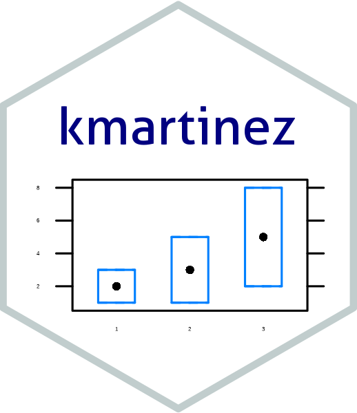

# About me

Welcome visitor!, I'm Kevin,  a physician and epidemiologist with expertise in chronic disease epidemiology and prevention. Currently I'm an Impact Scholar (Postdoctoral Research Fellow) with the Center for Global Health Equity at the University of Michigan, School of Medicine. 

  

